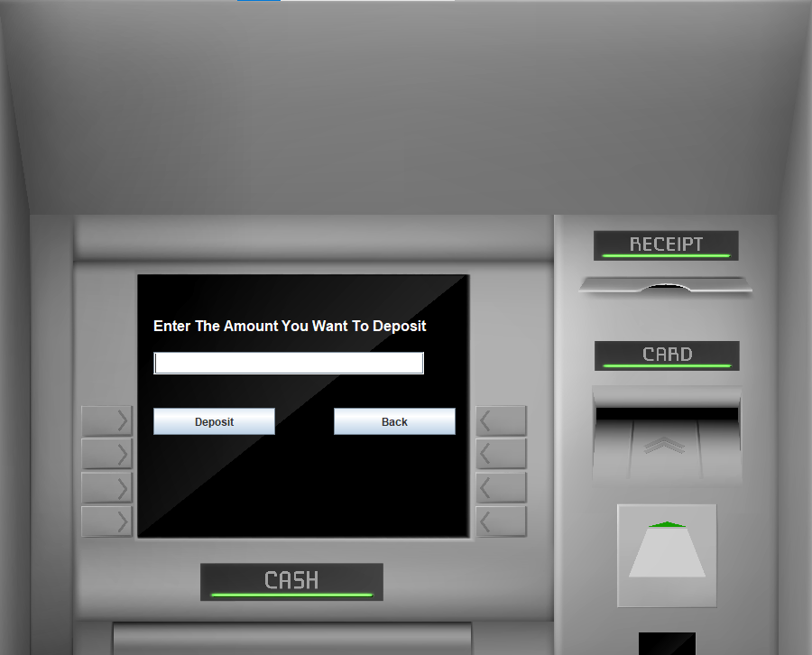
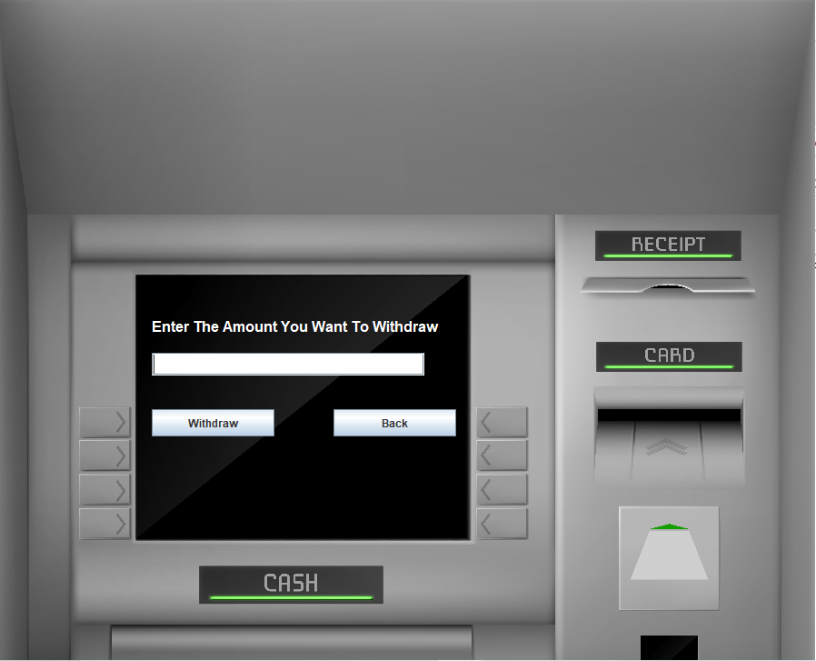
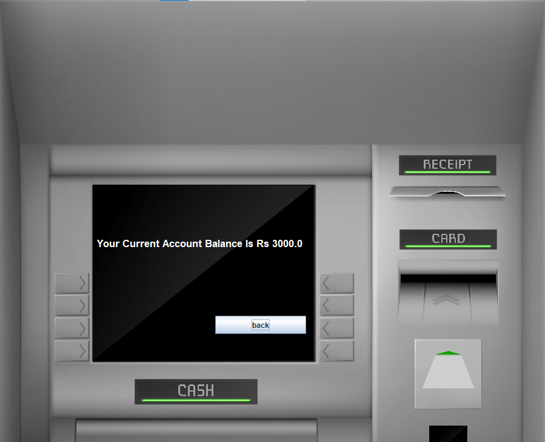
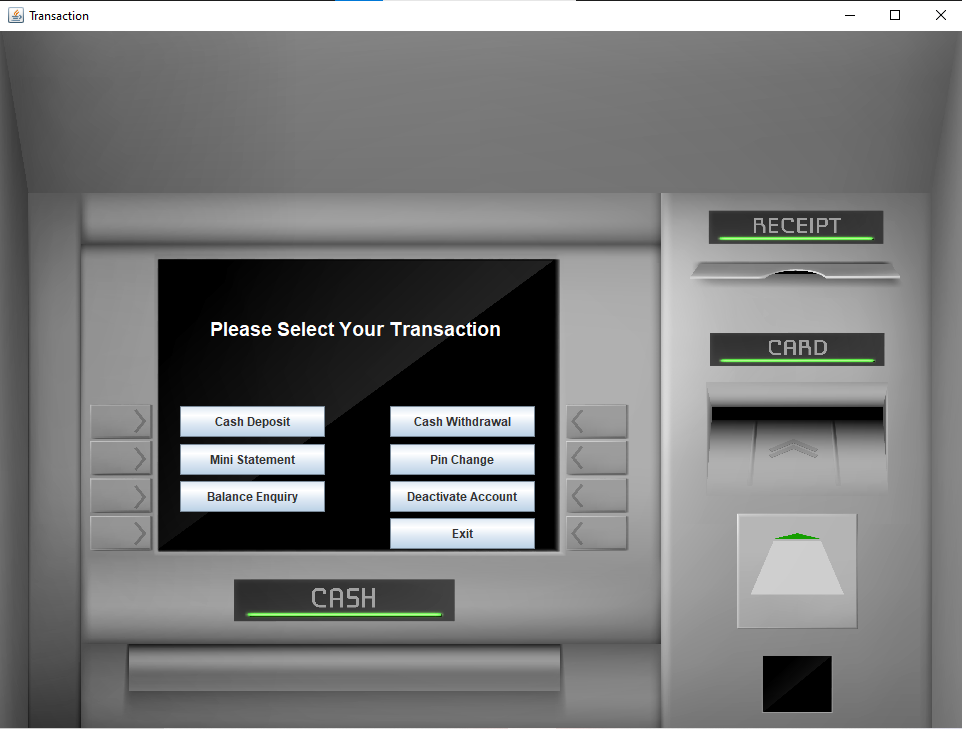
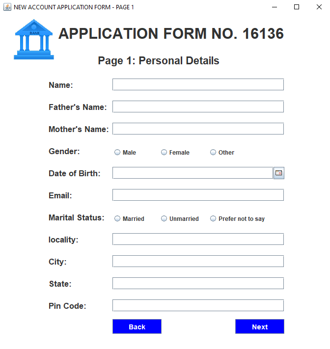
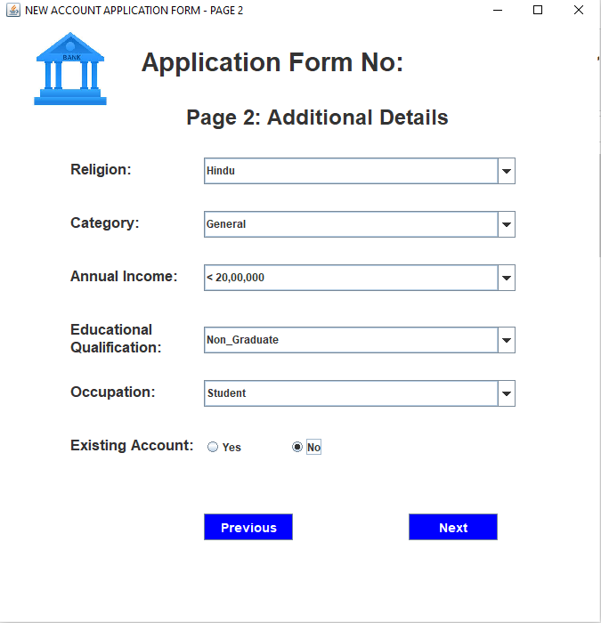

# 🦠Bank Management System

A simple Bank Management System made using **Java Swing** and **MySQL**, allowing users to create accounts, deposit money, withdraw funds, and view transaction history.

---

## 📸 Screenshots

### 🔠Login Screen


### 💰 Deposit 


### 💸 Withdrawal


### 💳 Balance Enquiry


### 🧾 Mini Statement


### 🔄 Transactions


### 🔢 PIN Change


### 📠Sign Up (Step 1)


### âœï¸ Sign Up (Step 2)


### ✅ Sign Up (Step 3)


---

## 📌 Features

- Create new bank accounts
- Deposit and withdraw money
- Check account balance
- View transaction history
- User-friendly interface with Java Swing
- MySQL Database integration

---

## ğŸ› ï¸ Tech Stack

- **Java (Swing for GUI)**
- **MySQL**
- **JDBC (Java Database Connectivity)**

---

## 📂 Project Structure
BankManagementSystem/
│
├── dist/
│
├── nbproject/
│
├── src/
│   ├── 🔌 connection.java       → Handles database connections
│   ├── 🔠Login.java            → User login screen
│   ├── 💰 Deposit.java          → Deposit money functionality
│   ├── 💸 Withdraw.java         → Withdraw money functionality
│   ├── 📊 BalanceEnquiry.java   → Check account balance
│   ├── 📜 MiniStatement.java    → Shows recent transaction history
│   ├── 📠Signup.java           → New account signup form
│   ├── 🔄 Transaction.java      → Transaction record handler (if you have this)
│   └── ... (other Java files)
│
├── 📄 .gitignore
├── 📑 BMS Queries.sql          → Example SQL queries
├── ğŸ—„ï¸ BMS Schema.sql            → Database schema definition
├── âš™ï¸ build.xml
├── 📜 manifest.mf
└── 📖 README.md


---

## 🚀 Getting Started

### 📌 Prerequisites:
- Java JDK installed
- MySQL Server installed
- A Java IDE (like NetBeans or IntelliJ)

---

### 📌 Setup Instructions:
1. Clone this repository:
   ```bash
   git clone https://github.com/Powar-Goutxm/BankManagementSystem.git

2. Import the project into your IDE.

3. Create the database:

    Run BMS Schema.sql to create the database and tables.

    Run BMS Queries.sql for some sample queries (if needed).

4. Update your connection.java file with your MySQL credentials.

5. Build and run the project.   

---

### 🌱 Future Improvements
- Implement password encryption
- Add user account management
- Introduce transaction filtering and search
- Deploy as a desktop installer

---

### 📃 License
- This project is open-source and available under the MIT License.

---

### 🤠Connect with Me
- GitHub: Powar-Goutxm
- LinkedIn: www.linkedin.com/in/goutam-powar